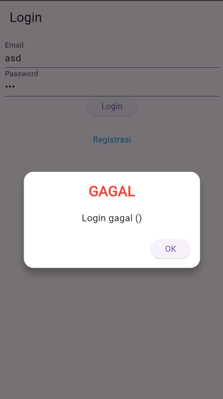
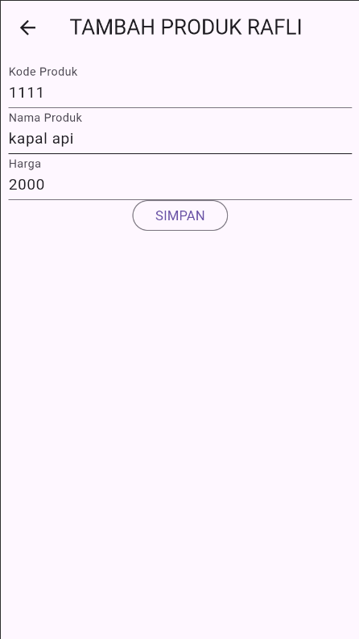
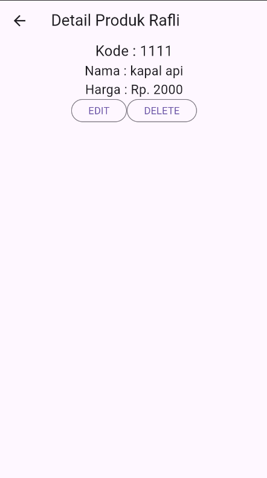
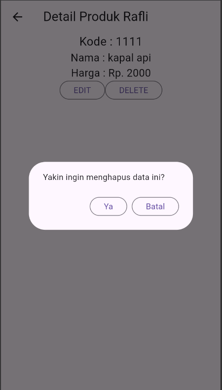

Penjelasan Toko Kita

## 1. Proses Login

### a. Form Login
- File terkait: `login_page.dart` di `/lib/ui/`.
- 
- Form ini meminta input username dan password dari pengguna.
- **Kode**:
  ```dart
  TextField(
    controller: _usernameController,
    decoration: InputDecoration(
      labelText: 'Username',
    ),
  ),
  TextField(
    controller: _passwordController,
    decoration: InputDecoration(
      labelText: 'Password',
      obscureText: true,
    ),
  ),
  ElevatedButton(
    onPressed: () {
      context.read<LoginBloc>().add(
        LoginSubmitted(
          username: _usernameController.text,
          password: _passwordController.text,
        ),
      );
    },
    child: Text('Login'),
  ),
  ```
- **Penjelasan**: Ketika tombol login ditekan, event `LoginSubmitted` dikirim ke `LoginBloc` dengan data yang diinput.

### b. Validasi dan Proses Login
- File terkait: `login_bloc.dart` di `/lib/bloc/`.
- Fungsi login memproses input dari user dan mengirim request ke API.
- **Kode**:
  ```dart
  on<LoginSubmitted>((event, emit) async {
    emit(LoginLoading());
    try {
      final response = await api.login(event.username, event.password);
      if (response.success) {
        emit(LoginSuccess());
      } else {
        emit(LoginFailure(error: response.message));
      }
    } catch (e) {
      emit(LoginFailure(error: e.toString()));
    }
  });
  ```
- **Penjelasan**: Fungsi ini memvalidasi username dan password. Jika berhasil, status berubah menjadi `LoginSuccess`; jika gagal, status berubah menjadi `LoginFailure`.

### c. Popup Berhasil/Gagal
- File terkait: `success_dialog.dart` dan `warning_dialog.dart` di `/lib/widget/`.
- 
- **Kode**:
  ```dart
  showDialog(
    context: context,
    builder: (context) => AlertDialog(
      title: Text('Login Gagal'),
      content: Text('Login gagal ()'),
      actions: [
        TextButton(
          onPressed: () => Navigator.of(context).pop(),
          child: Text('OK'),
        ),
      ],
    ),
  );
  ```
- **Penjelasan**: Jika login gagal, dialog peringatan ditampilkan dengan pesan kesalahan.

## 2. Proses CRUD Produk

### a. Tambah Data Produk
- File terkait: `produk_form.dart` di `/lib/ui/`.
- 
- **Kode**:
  ```dart
  ElevatedButton(
    onPressed: () {
      final product = Product(
        name: _nameController.text,
        price: double.parse(_priceController.text),
      );
      context.read<ProdukBloc>().add(AddProdukEvent(product));
    },
    child: Text('Tambah Produk'),
  );
  ```
- **Penjelasan**: Setelah pengguna mengisi form dan menekan tombol, data produk dikirim sebagai event `AddProdukEvent` ke `ProdukBloc`.

### b. Tampil Data Produk
- File terkait: `produk_page.dart` di `/lib/ui/`.
- 
- **Kode**:
  ```dart
  BlocBuilder<ProdukBloc, ProdukState>(
    builder: (context, state) {
      if (state is ProdukLoading) {
        return CircularProgressIndicator();
      } else if (state is ProdukLoaded) {
        return ListView.builder(
          itemCount: state.produkList.length,
          itemBuilder: (context, index) {
            final produk = state.produkList[index];
            return ListTile(
              title: Text(produk.name),
              subtitle: Text('\$${produk.price}'),
            );
          },
        );
      } else {
        return Text('Gagal memuat produk');
      }
    },
  );
  ```
- **Penjelasan**: `BlocBuilder` membangun UI berdasarkan state. Jika loading, tampilkan indikator; jika berhasil, tampilkan daftar produk.

### c. Update Data Produk
- File terkait: `produk_detail.dart` di `/lib/ui/`.
- 
- **Kode**:
  ```dart
  ElevatedButton(
    onPressed: () {
      final updatedProduct = Product(
        id: product.id,
        name: _nameController.text,
        price: double.parse(_priceController.text),
      );
      context.read<ProdukBloc>().add(UpdateProdukEvent(updatedProduct));
    },
    child: Text('Update Produk'),
  );
  ```
- **Penjelasan**: Setelah pengguna mengedit data dan menekan tombol, produk diperbarui di database.

### d. Hapus Data Produk
- File terkait: `produk_page.dart` di `/lib/ui/`.
- 
- **Kode**:
  ```dart
  IconButton(
    icon: Icon(Icons.delete),
    onPressed: () {
      context.read<ProdukBloc>().add(DeleteProdukEvent(produk.id));
    },
  );
  ```
- **Penjelasan**: Fungsi ini menghapus produk dari sistem berdasarkan ID produk.
