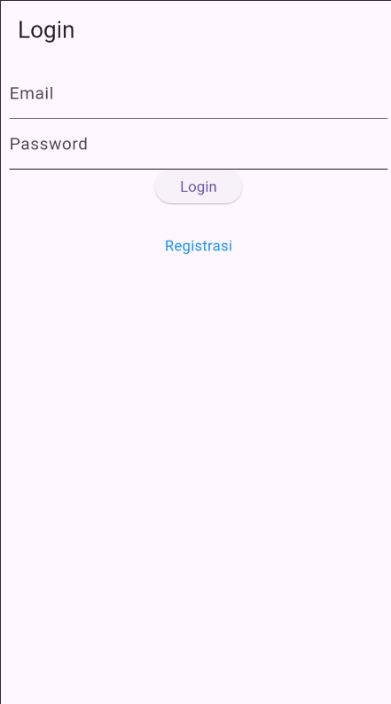
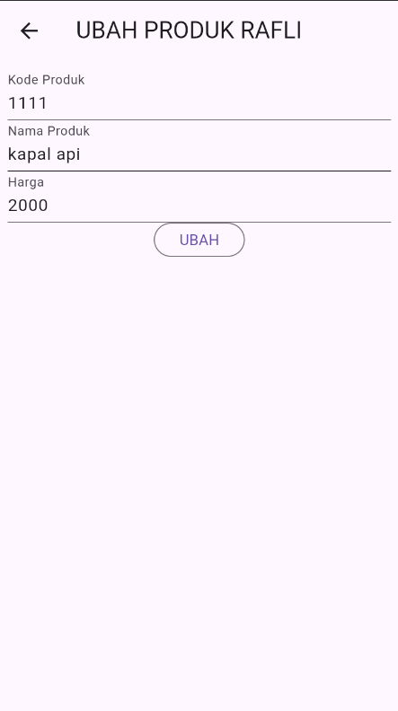

Penjelasan Toko Kita

## 1. Proses Login

### a. Form Login
- File terkait: `login_page.dart` di `/lib/ui/`.
- 
- Form ini meminta input username dan password dari pengguna.
- **Kode**:
  ```dart
  class _LoginPageState extends State<LoginPage> {
  final _formKey = GlobalKey<FormState>();
  bool _isLoading = false;
  final _emailTextboxController = TextEditingController();
  final _passwordTextboxController = TextEditingController();

  @override
  Widget build(BuildContext context) {
    return Scaffold(
      appBar: AppBar(
        title: const Text('Login'),
      ),
      body: SingleChildScrollView(
        child: Padding(
          padding: const EdgeInsets.all(8.0),
          child: Form(
            key: _formKey,
            child: Column(
              children: [
                _emailTextField(),
                _passwordTextField(),
                _buttonLogin(),
                const SizedBox(
                  height: 30,
                ),
                _menuRegistrasi()
              ],
            ),
          ),
        ),
      ),
    );
  }

  Widget _emailTextField() {
    return TextFormField(
      decoration: const InputDecoration(labelText: "Email"),
      keyboardType: TextInputType.emailAddress,
      controller: _emailTextboxController,
      validator: (value) {
        if (value!.isEmpty) {
          return 'Email harus diisi';
        }
        return null;
      },
    );
  }

  Widget _passwordTextField() {
    return TextFormField(
      decoration: const InputDecoration(labelText: "Password"),
      keyboardType: TextInputType.text,
      obscureText: true,
      controller: _passwordTextboxController,
      validator: (value) {
        if (value!.isEmpty) {
          return "Password harus diisi";
        }
        return null;
      },
    );
  }

  Widget _buttonLogin() {
    return ElevatedButton(
      child: const Text("Login"),
      onPressed: () {
        var validate = _formKey.currentState!.validate();
        if (validate) {
          if (!_isLoading) _submit();
        }
      },
    );
  }

  void _submit() {
    _formKey.currentState!.save();
    setState(() {
      _isLoading = true;
    });
    LoginBloc.login(
        email: _emailTextboxController.text,
        password: _passwordTextboxController.text
    ).then((value) async {
      print("Login successful: $value");
      if (value.userID != null) {
        await UserInfo().setToken(value.token ?? "");
        await UserInfo().setUserID(value.userID!);
        Navigator.pushReplacement(context,
            MaterialPageRoute(builder: (context) => const ProdukPage()));
      } else {
        throw Exception("UserID is null");
      }
    }).catchError((error) {
      print("Login error: $error");
      showDialog(
          context: context,
          barrierDismissible: false,
          builder: (BuildContext context) => WarningDialog(
            description: "Login gagal ${()}",
          )
      );
    }).whenComplete(() {
      setState(() {
        _isLoading = false;
      });
    });
  }

  Widget _menuRegistrasi() {
    return Center(
      child: InkWell(
        child: const Text(
          "Registrasi",
          style: TextStyle(color: Colors.blue),
        ),
        onTap: () {
          Navigator.push(context,
              MaterialPageRoute(builder: (context) => const RegistrasiPage()));
        },
      ),
    );
  }
  }
  ```
- **Penjelasan**: Ketika tombol login ditekan, event `Submitted` dikirim ke `LoginBloc` dengan data yang diinput.

### b. Validasi dan Proses Login
- File terkait: `login_bloc.dart` di `/lib/bloc/`.
- Fungsi login memproses input dari user dan mengirim request ke API.
- **Kode**:
  ```dart
  class LoginBloc {
    static Future<Login> login({String? email, String? password}) async {
      String apiUrl = ApiUrl.login;
      var body = {"email": email, "password": password};
      var response = await Api().post(apiUrl, body);
      var jsonObj = json.decode(response.body);
      return Login.fromJson(jsonObj);
    }
  }
  ```
- **Penjelasan**: Fungsi ini memvalidasi username dan password.

### c. Popup Berhasil/Gagal
- File terkait: `success_dialog.dart` dan `warning_dialog.dart` di `/lib/widget/`.
- 
- **Kode**:
  ```dart
  void _submit() {
    _formKey.currentState!.save();
    setState(() {
      _isLoading = true;
    });
    LoginBloc.login(
        email: _emailTextboxController.text,
        password: _passwordTextboxController.text
    ).then((value) async {
      print("Login successful: $value");
      if (value.userID != null) {
        await UserInfo().setToken(value.token ?? "");
        await UserInfo().setUserID(value.userID!);
        Navigator.pushReplacement(context,
            MaterialPageRoute(builder: (context) => const ProdukPage()));
      } else {
        throw Exception("UserID is null");
      }
    }).catchError((error) {
      print("Login error: $error");
      showDialog(
          context: context,
          barrierDismissible: false,
          builder: (BuildContext context) => WarningDialog(
            description: "Login gagal ${()}",
          )
      );
    }).whenComplete(() {
      setState(() {
        _isLoading = false;
      });
    });
  }
  ```
- **Penjelasan**: Jika login gagal, dialog peringatan ditampilkan dengan pesan kesalahan.

## 2. Proses CRUD Produk

### a. Tambah Data Produk
- File terkait: `produk_form.dart` di `/lib/ui/`.
- 
- **Kode**:
  ```dart
  final _formKey = GlobalKey<FormState>();
  bool _isLoading = false;
  String judul = "TAMBAH PRODUK RAFLI";
  String tombolSubmit = "SIMPAN";
  final _kodeProdukTextboxController = TextEditingController();
  final _namaProdukTextboxController = TextEditingController();
  final _hargaProdukTextboxController = TextEditingController();
  @override
  ```
- **Penjelasan**: Setelah pengguna mengisi form dan menekan tombol, data produk dikirim sebagai event `AddProduk`.

### b. Tampil Data Produk
- File terkait: `produk_page.dart` di `/lib/ui/`.
- 
- **Kode**:
  ```dart
  class ListProduk extends StatelessWidget {
    final List? list;
    const ListProduk({Key? key, this.list}) : super(key: key);
    @override
    Widget build(BuildContext context) {
      return ListView.builder(
          itemCount: list == null ? 0 : list!.length,
          itemBuilder: (context, i) {
            return ItemProduk(
              produk: list![i],);
          });
    }
  }
  ```
- **Penjelasan**: `BlocBuilder` membangun UI berdasarkan state. Jika loading, tampilkan indikator; jika berhasil, tampilkan daftar produk.

### c. Update Data Produk
- 
- **Kode**:
  ```dart
  ubah() {
    setState(() {
      _isLoading = true;
    });
    Produk updateProduk = Produk(id: widget.produk!.id!);
    updateProduk.kodeProduk = _kodeProdukTextboxController.text;
    updateProduk.namaProduk = _namaProdukTextboxController.text;
    updateProduk.hargaProduk = int.parse(_hargaProdukTextboxController.text);
    ProdukBloc.updateProduk(produk: updateProduk).then((value) {
      Navigator.of(context).push(MaterialPageRoute(
          builder: (BuildContext context) => const ProdukPage()));}, onError: (error) {
      showDialog(
          context: context,
          builder: (BuildContext context) => const WarningDialog(
            description: "Permintaan ubah data gagal, silahkan coba lagi",
          ));
    });
    setState(() {
      _isLoading = false;
    });
  }
  ```
- **Penjelasan**: Setelah pengguna mengedit data dan menekan tombol, produk diperbarui di database.

### d. Hapus Data Produk
- 
- **Kode**:
  ```dart
  void confirmHapus() {AlertDialog alertDialog = AlertDialog(
      content: const Text("Yakin ingin menghapus data ini?"),
      actions: [
        OutlinedButton(
          child: const Text("Ya"),
          onPressed: () {
            ProdukBloc.deleteProduk(id: int.parse(widget.produk!.id!)).then(
                    (value) => {
                  Navigator.of(context).push(MaterialPageRoute(
                      builder: (context) => const ProdukPage()))
                }, onError: (error) {
              showDialog(
                  context: context,
                  builder: (BuildContext context) => const WarningDialog(
                    description: "Hapus gagal, silahkan coba lagi",
                  ));
            });
          },
        ),
  //tombol batal
        OutlinedButton(
          child: const Text("Batal"),
          onPressed: () => Navigator.pop(context),
        )
      ],
    );
  ```
- **Penjelasan**: Fungsi ini menghapus produk dari sistem.
